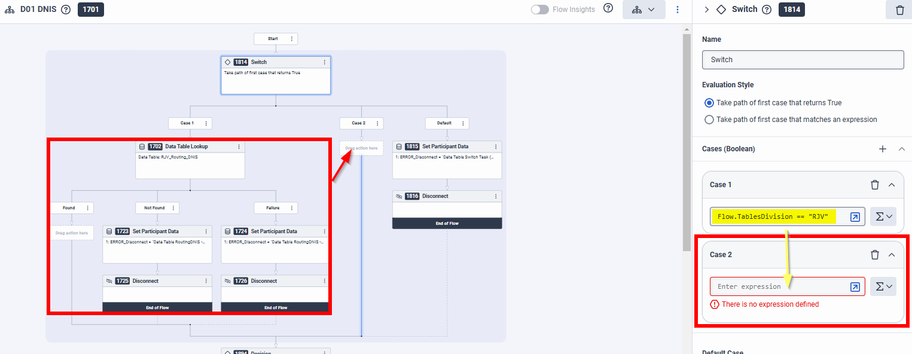

### Original Notes from RJV

I think we need two packaged, one for the base install and 1 to add data tables for an extra division table set.
Is it possible to have the naming of the items as variables in the package? I mean to rename the items during the creation in the target org.

The configuration is in the psemeaconsulting03 org in EUW1

The content of the packages are these:

## Package One: Base Setup
|Name|Type|
|:----|:----|
|RJV Menhir Direct Tables|Inbound Call Flow|
|RJV LastAgentRouting|Common Module Flow|
|RJV PlayPrompt DirectTable|Common Module Flow|
|RJV SetLanguage|Common Module Flow|
|RJV Customer Journey|Common Module Flow|
|RJV Get Last Agent Handled a Voice Interaction by Phone Number|Data Action|
|RJV Get onQueue Agent by QueueId|Data Action|
|RJV_Routing_Prompts|Data Table|
|RJV_Routing_Destination|Data Table|
|RJV_Routing_Specialties|Data Table|
|RJV_Routing_Menu|Data Table|
|RJV_Routing_Scheduling|Data Table|
|RJV_Routing_LanguageMenu|Data Table|
|RJV_Routing_DNIS|Data Table|
|RJV_Global_TablesDivision|Data Table|
|RJV Menhir In-Queue New|In-Queue Call Flow|
|RJV_TransferToFlowExample|Inbound Call Flow|
|RJV Menhir|Script|
|Genesys Enhanced TTS|Text To Speech Engine|
|de-DE-Standard-A|Voice|
|fr-FR-Standard-A|Voice|
|en-US-Standard-A|Voice|
|en-GB-Standard-A|Voice|
|nl-NL-Standard-A|Voice|
|RJV_MenhirVoiceSurvey_FR|Voice Survey Flow|
|RJV_MenhirVoiceSurvey_DE|Voice Survey Flow|
|RJV_MenhirVoiceSurvey_EN|Voice Survey Flow|
|RJV_MenhirVoiceSurvey_NL|Voice Survey Flow|
|RJV_MoH_abstractfashion|Prompt|
|RJV_MoH_abstractfashion_RJV|Prompt|
|RJV_MoH_asmallmiracle|Prompt|
|RJV_MoH_asmallmiracle_RJV|Prompt|
|Prompt_Lang_CR_Menu|Prompt|
|Prompt_Lang_CR_Menu_RJV|Prompt|
|de-de|Language|
|en-gb|Language|
|en-us|Language|
|fr-fr|Language|
|nl-nl|Language|

## Package 2: Adding Tables in a New or Specific Division
|Name|Type|
|:----|:----|
|RJV_Routing_Prompts|Data Table|
|RJV_Routing_Destination|Data Table|
|RJV_Routing_Specialties|Data Table|
|RJV_Routing_Menu|Data Table|
|RJV_Routing_Scheduling|Data Table|
|RJV_Routing_LanguageMenu|Data Table|
|RJV_Routing_DNIS|Data Table|
|RJV_Global_TablesDivision|Data Table|

One other question I have:
Can we change flows as well with CX as a Code?
Example: adding a new case to a switch and copying a data table lookup to the new case.

